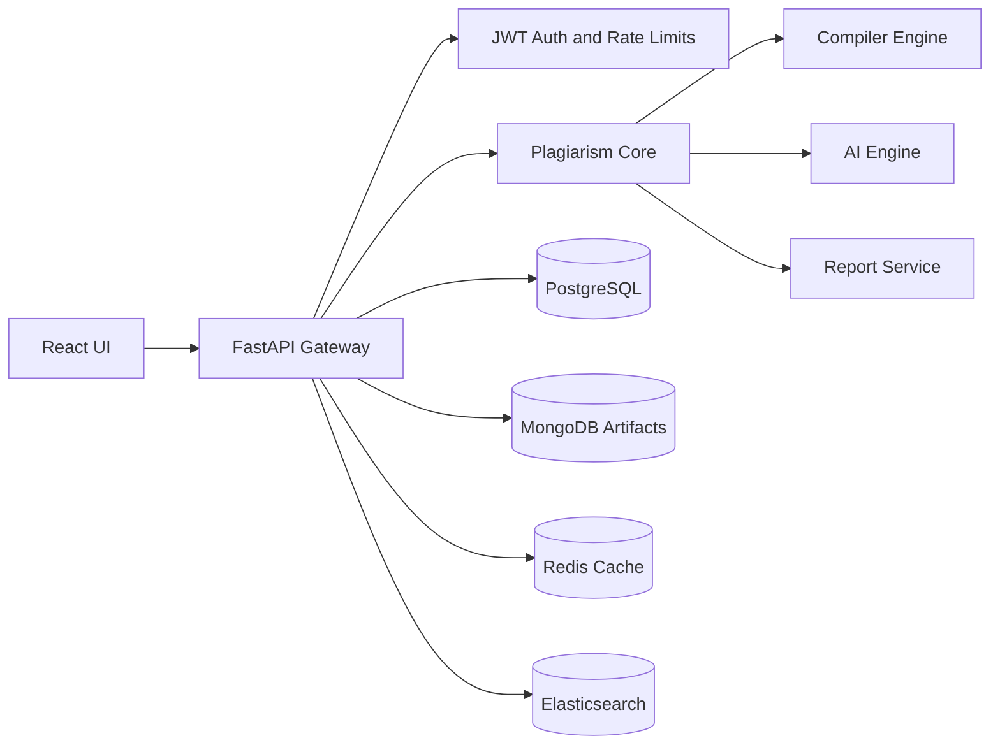

# Architecture

## Request Flow

1. Frontend submits two files or pasted code samples.
2. Backend validates file type, size, and encoding.
3. Compiler engine normalizes tokens, builds AST, constructs CFG and PDG, and emits intermediate artifacts.
4. Plagiarism core computes text, token, AST, graph, and semantic similarity.
5. AI engine computes embeddings, stylometry, cross-language similarity, and AI-generation probability.
6. Weighted score fusion creates an explainable risk score.
7. Report service emits JSON/CSV/PDF-ready payloads for visualization and export.

## Compiler Concepts

- Lexical analysis removes comments, whitespace, and superficial identifier differences.
- AST comparison catches formatting changes and variable renaming.
- CFG comparison catches loop and branch preserving rewrites.
- PDG comparison models control and data dependencies for algorithm-level similarity.
- IR generation provides a stable layer for future SSA and optimization-pass analysis.

